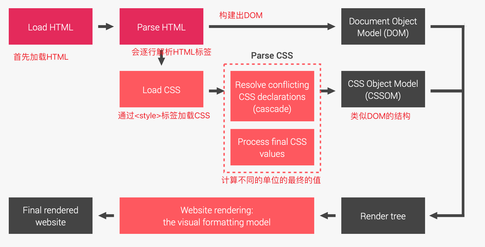
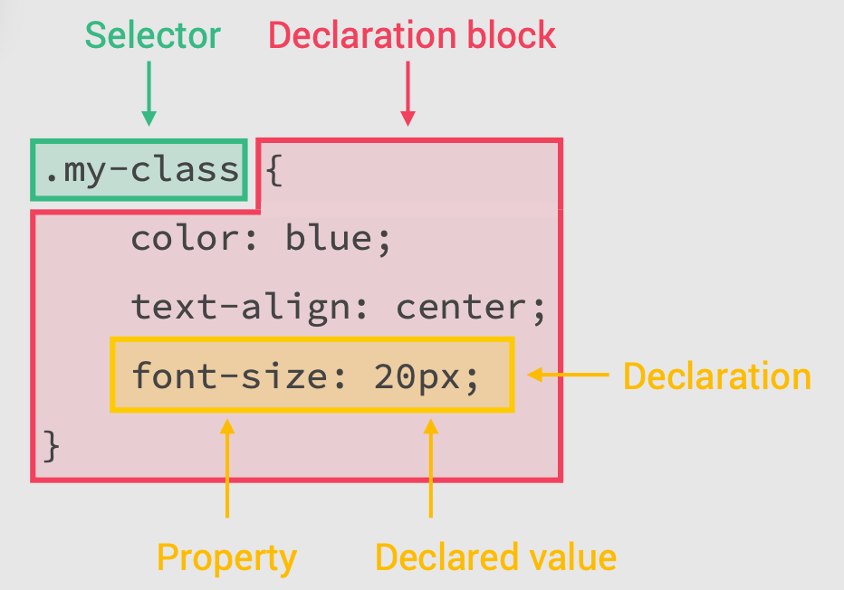
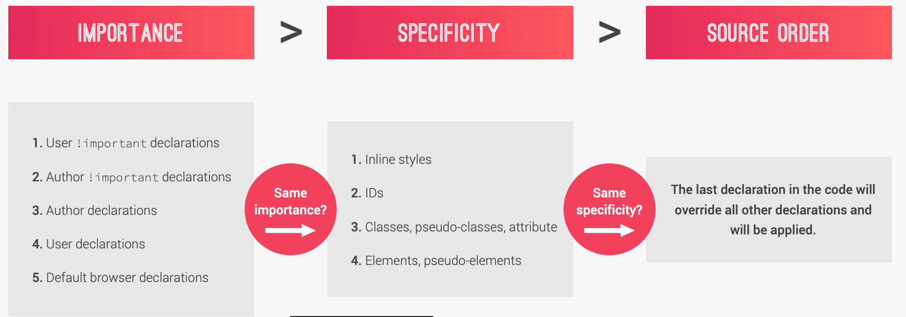
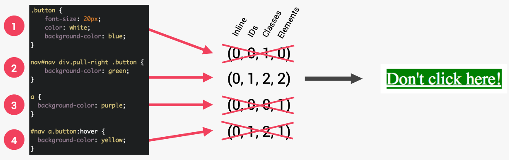
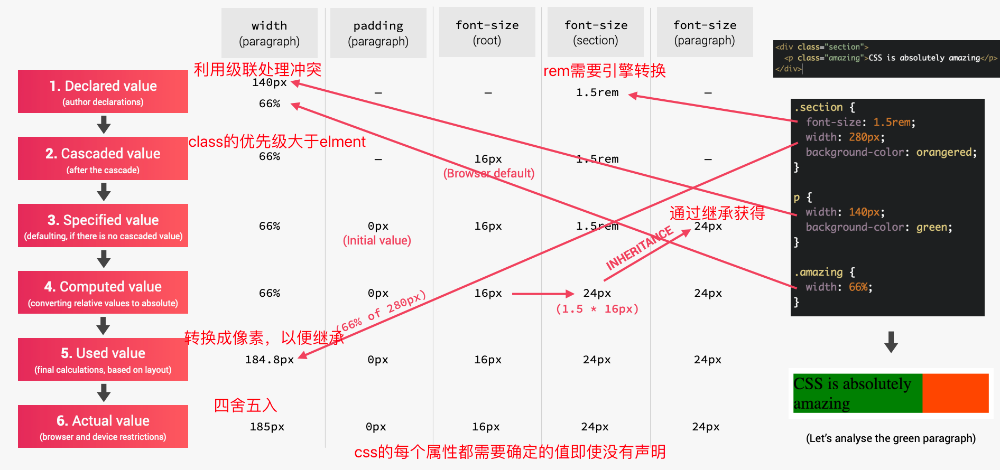
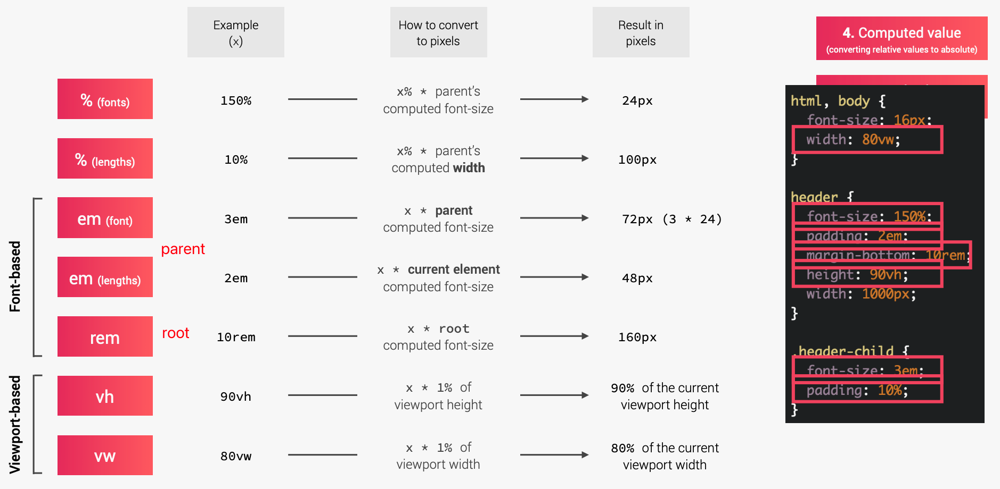

# 三个重要的基本原则

## 响应式设计 

- Fluid layouts
- Media queries
- Responsive images
- Correct units
- Desktop-first vs mobile-first

## 可维护和可扩展

- Clean
- Easy-to-understand
- Growth
- Reusable
- How to organize files
- How to name classes
- How to structure HTML

## 网络性能

- Less HTTP requests
- Less code
- Compress code
- Use a CSS preprocessor
- Less images
- Compress images

# CSS背后是如何工作的

selector可以有多个，{ }中就是我们编写样式的地方，设置CSS属性并给出明确的定义

# 级联 CASCADE(C in CSS)

如何解决冲突

同时制定了4个不同的background- color，是如何最终确定的，优先级从大到小是inline ，IDs，Classes，Elements，inline是HTML指定的所以都是0，而1和3都没有ID选择器，所以首先排除，最终2的Elements比4大一，所以最后确定使用2设置的属性来渲染页面 

总结：

标有 !important 的 CSS 声明具有最高优先级；

• 内联样式总是优先于外部样式表中的样式；
• 包含 1 个 ID 的选择器比包含 1000 个类的选择器更优先；
• 包含 1 个类的选择器比包含 1000 个元素的选择器更优先；
• 通用选择器 * 没有特定值 (0, 0, 0, 0)；
• 更多地依赖特异性而不是选择器的顺序；
• 但是，在使用第 3 方样式表时要依赖顺序 — 始终将自己的样式表放在最后。

https://codepen.io/pen/ 能简单编写html，css，js查看效果

# 如何计算出value

css属性有很多单位，rem，deg，px，%...

是实现响应式设计的基础