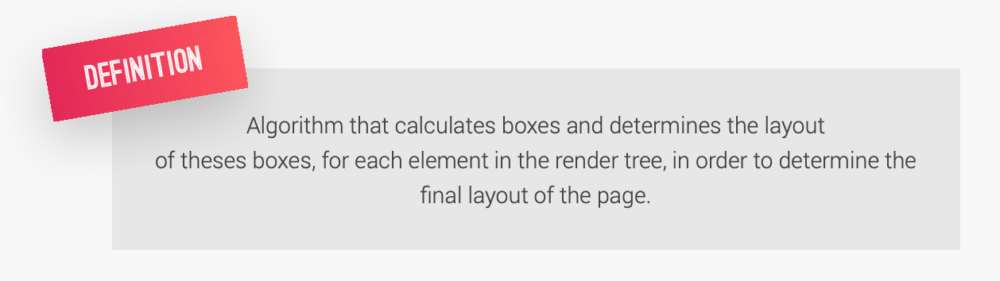

# 三个重要的基本原则

## 响应式设计 

- Fluid layouts
- Media queries
- Responsive images
- Correct units
- Desktop-first vs mobile-first

## 可维护和可扩展

- Clean
- Easy-to-understand
- Growth
- Reusable
- How to organize files
- How to name classes
- How to structure HTML

## 网络性能

- Less HTTP requests
- Less code
- Compress code
- Use a CSS preprocessor
- Less images
- Compress images

# CSS背后是如何工作的

selector可以有多个，{ }中就是我们编写样式的地方，设置CSS属性并给出明确的定义

# 级联 CASCADE(C in CSS)

如何解决冲突

同时制定了4个不同的background- color，是如何最终确定的，优先级从大到小是inline ，IDs，Classes，Elements，inline是HTML指定的所以都是0，而1和3都没有ID选择器，所以首先排除，最终2的Elements比4大一，所以最后确定使用2设置的属性来渲染页面 

总结：

标有 !important 的 CSS 声明具有最高优先级；

• 内联样式总是优先于外部样式表中的样式；
• 包含 1 个 ID 的选择器比包含 1000 个类的选择器更优先；
• 包含 1 个类的选择器比包含 1000 个元素的选择器更优先；
• 通用选择器 * 没有特定值 (0, 0, 0, 0)；
• 更多地依赖特异性而不是选择器的顺序；
• 但是，在使用第 3 方样式表时要依赖顺序 — 始终将自己的样式表放在最后。

https://codepen.io/pen/ 能简单编写html，css，js查看效果

# 如何计算出value

css属性有很多单位，rem，deg，px，%...

是实现响应式设计的基础

# CSS渲染网页

- Dimensions of boxes: the box model; 
- Box type: inline, block and inline-block; 
- Positioning scheme: floats and positioning; 
- Stacking contexts;
- Other elements in the render tree;
- Viewport size, dimensions of images, etc.

## 盒子模型

- **Margin(外边距)** - 清除边框外的区域，外边距是透明的。
- **Border(边框)** - 围绕在内边距和内容外的边框。
- **Padding(内边距)** - 清除内容周围的区域，内边距是透明的。
- **Content(内容)** - 盒子的内容，显示文本和图像。

## inline，block and inline-block

块元素是一个元素，占用了全部宽度，在前后都是换行符。

内联元素只需要必要的宽度，不强制换行。

https://www.runoob.com/css/css-display-visibility.html

## 定位

https://www.runoob.com/css/css-positioning.html

# CSS架构

## Think

- 模块化组件
- 由页面的整体布局组合到一起
- **可重用**，可以跨项目使用，因此不能依赖父元素

## Build 

BEM Block Element Modifier 

• BLOCK: standalone component that is meaningful on its own. 

• ELEMENT: part of a block that has no standalone meaning. 

• MODIFIER: a different version of a block or an element.

## Architect

# 在先前的项目中实践BEM

判断是否可以作为一个独立的块

如果不可以，在类名上需要体现出来，包含依赖的父元素，

- 如果是元素，类似header__logo
- 如果是modifier则使用阔折号, 类似 heading-primary--main