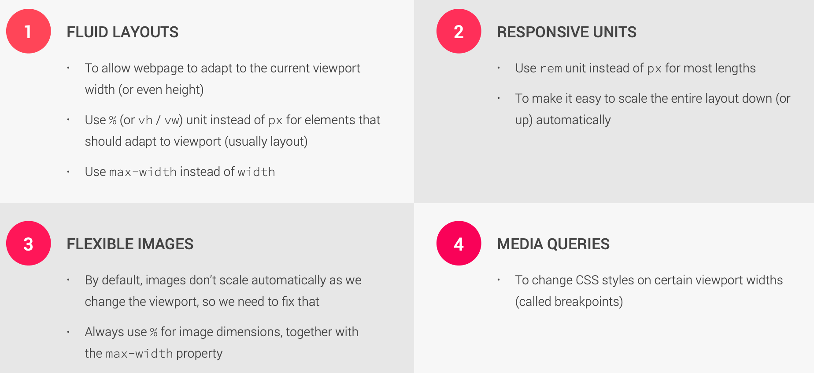
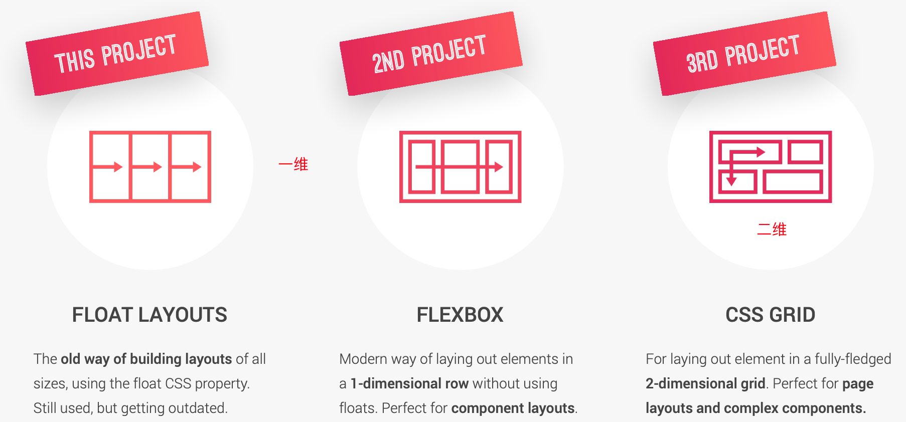
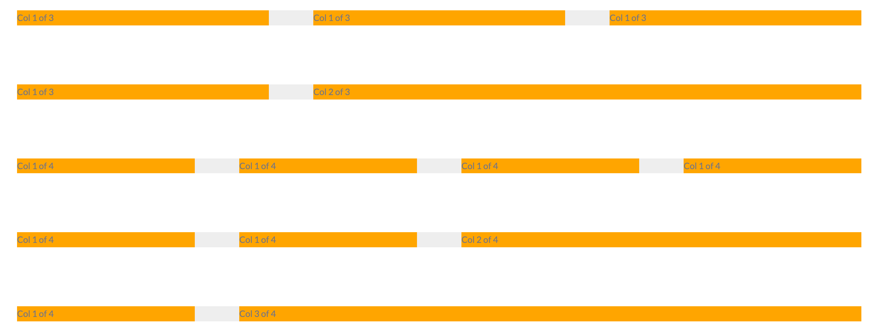
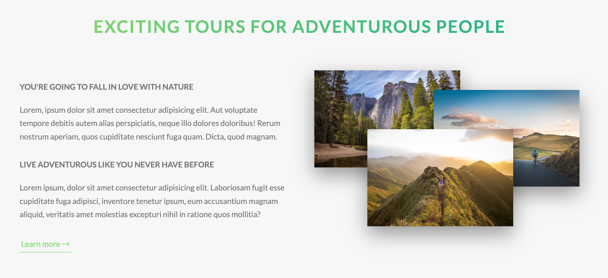
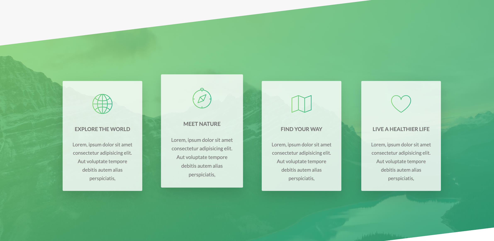

# 1. 响应式设计的原则

## 1.1 响应式设计的基本原则



## 1.2 layout类型



# 2. 利用float: left 实现grid 布局

实现类似grid layou



1. 利用伪类:last-child 设置margin
2. 利用属性选择器 [class^="col-"] 对所有的"col-"开头的class设置通用属性
3. 计算width 根据 num of num，使用cal()

# 3.构建 THE ABOUT SECTION



利用前面grid layout 的基础，将文字和图片分为两列

1. 文字部分，设置标题和段落样式，设置一个新的文字button的组件
2. 图片部分，鼠标hover实现缩放的效果，利用outline的属性设置边框，利用z-index解决图片遮挡

# 4.构建 features section

我们构建了这样的页面



首先，学了如何使用icon font，并推荐了相关网站

构建了feature-box的组件，使得能够复用

使用了新的方法去实现header的clip-path，

```scss
    transform: skewY(-7deg);
    // 选择所有的子元素,消除倾斜
    &>* {
        transform: skewY(7deg);
    }
```


